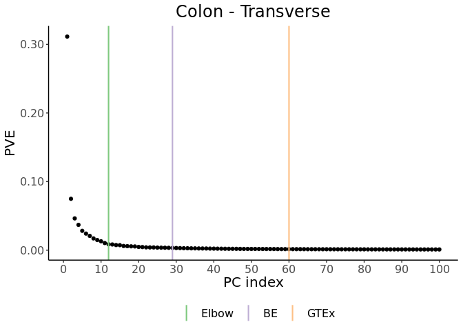

PCA for hidden variable inference in QTL mapping
================

We have shown that PCA is faster, better-performing, and much easier to
interpret and use than popular hidden variable inference methods for QTL
mapping including SVA, PEER, and HCP (2022). Here we aim to provide some
guidance on **how to use PCA** for hidden variable inference in QTL
mapping and in particular **how to choose *K*** (the number of PCs)
using the functions provided in this package. This package implements
two simple, highly interpretable methods for choosing the number of PCs:
an **automatic elbow detection method** (based on distance to the
diagonal line) and the **Buja and Eyuboglu (BE) algorithm** (1992) (a
permutation-based approach). Detailed descriptions of both methods can
be found in our paper (2022).

## 1. Installation

``` r
#install.packages("devtools")
devtools::install_github("heatherjzhou/PCAForQTL")
```

## 2. How to run PCA

We start with the **fully processed** molecular phenotype matrix. In
this tutorial, we use the fully processed gene expression matrix for
Colon - Transverse from GTEx V8 (2020) as an example. In GTEx’s case,
“fully processed” means TPM normalized, filtered, TMM normalized, and
inverse normal transformed (see
[link](https://gtexportal.org/home/documentationPage); depending on your
specific situation, your procedure may be different). The data set can
be obtained directly from [link](https://gtexportal.org/home/datasets)
and is also made available under the folder named Example_Data in this
repository in a format that can be easily read into R.

First, download the example data set and load it into the environment
(change the path as necessary on your device).

``` r
dataGeneExpressionFP<-readRDS("./Example_Data/Colon_Transverse.v8.normalized_expression.rds") #25,379*372.
#The first four columns are chr, start, end, and gene_id.
```

Next, make sure that the data matrix is **observation by feature** and
contains no auxiliary information.

``` r
expr<-t(dataGeneExpressionFP[,-(1:4)]) #368*25,379. 368 samples, 25,379 genes.
# dim(expr)
```

Now we are ready to run PCA. In general, centering is almost always
mandatory, and scaling is almost always preferred when running PCA.
Since GTEx has already performed inverse normal transform on each
feature, whether centering and scaling are performed on our example data
does not affect the PCA result much. But we suggest **always centering
and scaling** to be safe.

``` r
prcompResult<-prcomp(expr,center=TRUE,scale.=TRUE) #This should take less than a minute.
PCs<-prcompResult$x #368*368. The columns are PCs.
# dim(PCs)
```

Note that the approach we use in this tutorial constitutes PCA_direct
rather than PCA_resid (2022). The two approaches perform similarly in
our simulation studies, so we choose PCA_direct because it is simpler.
In addition, PCA_direct can better hedge against the possibility that
the known covariates are not actually important confounders because in
PCA_direct, the known covariates do not affect the calculation of the
PCs.

Optionally, you may inspect the proportion of variance explained by the
PCs at this point. We omit this here because we will perform a more
thorough analysis in the next section.

``` r
# importanceTable<-summary(prcompResult)$importance
# PVEs<-importanceTable[2,]
# sum(PVEs) #Theoretically, this should be 1.
# plot(PVEs,xlab="PC index",ylab="PVE")
```

## 3. How to choose *K*

There are four main functions in this package: `runElbow()`, `runBE()`,
`makeScreePlot()`, and `filterKnownCovariates()`. The first three
functions help us choose *K*. The last function will be discussed in the
next section. For full details of these functions, run
`library(PCAForQTL)` followed by `?runElbow`, `?runBE`, etc.

`runElbow()` implements an automatic elbow detection method (based on
distance to the diagonal line). In our experience, the number of PCs
chosen using this method **tends to match the visual elbow point
reasonably well**. To run this function, simply input the previously
obtained `prcompResult`. This method selects *K* = 12 for our example
data.

``` r
resultRunElbow<-PCAForQTL::runElbow(prcompResult=prcompResult)
print(resultRunElbow)
```

    ## [1] 12

`runBE()` implements the BE algorithm, a permutation-based approach for
choosing *K* in PCA. Intuitively, the BE algorithm retains PCs that
explain more variance in the data than by random chance and discards
those that do not. In our experience, the number of PCs chosen via BE
**tends to signal an upper bound of the reasonable number of PCs to
choose**. To run this function, we need to input the data matrix (must
be observation by feature) and may optionally specify `B`, the number of
permutations (default is 20), and `alpha`, the significance level
(default is 0.05). We may also specify `mc.cores` to change how many
cores are used for parallel computing (default is `B` or the number of
available cores minus 1, whichever is smaller). For reproducibility,
Linux and Mac users must change the random number generator (RNG) type
(unless `mc.cores` is 1) and set the seed. On the other hand, Windows
users must set `mc.cores=1` to avoid error and set the seed for
reproducibility (no need to change the RNG type). The BE method selects
*K* = 29 for our example data.

Linux and Mac users:

``` r
RNGkind("L'Ecuyer-CMRG")
set.seed(1)
resultRunBE<-PCAForQTL::runBE(expr,B=20,alpha=0.05)
print(resultRunBE$numOfPCsChosen)
```

    ## [1] 29

Windows users:

``` r
set.seed(1) #No need to change the RNG type since mc.cores will need to be 1.
resultRunBE<-PCAForQTL::runBE(expr,B=20,alpha=0.05,
                              mc.cores=1)
print(resultRunBE$numOfPCsChosen)
```

After running `runElbow()` and/or `runBE()`, we recommend using
`makeScreePlot()` to **visualize the selected *K*’s**. If you have
candidate *K*’s chosen via other methods as well, you may also include
them here.

``` r
K_elbow<-resultRunElbow #12.
K_BE<-resultRunBE$numOfPCsChosen #29.
K_GTEx<-60 #GTEx uses 60 PEER factors, and they are almost identical to the top 60 PCs.
PCAForQTL::makeScreePlot(prcompResult,labels=c("Elbow","BE","GTEx"),values=c(K_elbow,K_BE,K_GTEx),
                         titleText="Colon - Transverse")
```

<!-- -->

We recommend saving the plot for each tissue type (using code similar to
below) in order to **compare across all tissue types** before making a
final decision on how to choose *K*.

``` r
ggplot2::ggsave("./Colon_Transverse.jpg",width=16,height=11,unit="cm")
```

Optionally, you may run your entire pipeline using a few different
choices of *K* (for example, 0, the number of PCs chosen via
`runElbow()`, and the number of PCs chosen via `runBE()`) and visualize
the number of discoveries versus *K* before making a final decision on
how to choose *K* (2017).

## 4. Using PCs in your QTL analysis

Lastly, it is good practice to filter out the known covariates that are
captured well by the inferred covariates (PCs) in order to avoid
redundancy. GTEx V8 (2020) uses eight known covariates: the top five
genotype PCs, WGS sequencing platform (HiSeq 2000 or HiSeq X), WGS
library construction protocol (PCR-based or PCR-free), and donor sex.
Similar to the gene expression matrix, these variables can be obtained
directly from [link](https://gtexportal.org/home/datasets) and are also
made available under the folder named Example_Data in this repository in
a format that can be easily read into R.

First, download the covariates and load them into the environment
(change the path as necessary on your device). Make sure that the known
covariate matrix is **observation by feature** and that the observations
match those in the molecular phenotype matrix (and hence the PCs). If
necessary, rename the known covariates to avoid potential confusion.

``` r
dataCovariates<-readRDS("./Example_Data/Colon_Transverse.v8.covariates.rds") #368*68.
#The columns are the top five genotype PCs, 60 PEER factors, pcr, platform, and sex.

knownCovariates<-dataCovariates[,c(1:5,66:68)] #368*8. 368 samples, 8 known covariates.
identical(rownames(knownCovariates),rownames(expr)) #TRUE is good.
```

    ## [1] TRUE

``` r
colnames(knownCovariates)[1:5]<-paste0("genotypePC",1:5) #This is to avoid potential confusion.
```

Suppose we have decided to use the number of PCs chosen via BE for our
example data.

``` r
PCsTop<-PCs[,1:K_BE] #368*29.
```

Now we use `filterKnownCovariates()` to **filter out the known
covariates that are captured well by the top PCs** (unadjusted
*R*<sup>2</sup> ≥ 0.9 by default). This function returns the known
covariates that should be kept. We use unadjusted *R*<sup>2</sup>
instead of adjusted *R*<sup>2</sup> because we do not want to penalize
for model complexity here. The cutoff value may be customized using the
argument `unadjustedR2_cutoff`.

``` r
knownCovariatesFiltered<-PCAForQTL::filterKnownCovariates(knownCovariates,PCsTop,unadjustedR2_cutoff=0.9)
```

Finally, we combine the remaining known covariates and the top PCs and
use them as covariates in the QTL analysis. To avoid potential numerical
inaccuracies in the QTL analysis, you may optionally scale the PCs to
unit variance, though theoretically this would not change the QTL result
from regression-based methods such as Matrix eQTL and FastQTL.

``` r
PCsTop<-scale(PCsTop) #Optional. Could be helpful for avoiding numerical inaccuracies.
covariatesToUse<-cbind(knownCovariatesFiltered,PCsTop)
```

## Citation

To acknowledge this package or this tutorial, please cite our preprint
(2022). For questions, please email us at <lijy03@g.ucla.edu> or
<heatherjzhou@ucla.edu>.

<!-- [-@stegleBayesianFrameworkAccount2010]. -->

## References

<div id="refs" class="references csl-bib-body hanging-indent">

<div id="ref-bujaRemarksParallelAnalysis1992" class="csl-entry">

Buja, Andreas, and Nermin Eyuboglu. 1992. “Remarks on Parallel
Analysis.” *Multivariate Behavioral Research* 27 (4): 509–40.

</div>

<div id="ref-gtexconsortiumGeneticEffectsGene2017" class="csl-entry">

GTEx Consortium. 2017. “Genetic Effects on Gene Expression Across Human
Tissues.” *Nature* 550 (7675): 204–13.

</div>

<div id="ref-gtexconsortiumGTExConsortiumAtlas2020" class="csl-entry">

———. 2020. “The GTEx Consortium Atlas of Genetic Regulatory Effects
Across Human Tissues.” *Science* 369 (6509): 1318–30.

</div>

<div id="ref-johnsonAppliedMultivariateStatistical2007"
class="csl-entry">

Johnson, Richard A., and Dean W. Wichern. 2007. *Applied Multivariate
Statistical Analysis*. Sixth. Upper Saddle River, NJ: Pearson Prentice
Hall.

</div>

<div id="ref-jolliffePrincipalComponentAnalysis2002" class="csl-entry">

Jolliffe, Ian T. 2002. *Principal Component Analysis*. Second. New York:
Springer.

</div>

<div id="ref-leekGeneralFrameworkMultiple2008" class="csl-entry">

Leek, Jefferey T., and John D. Storey. 2008. “A General Framework for
Multiple Testing Dependence.” *Proceedings of the National Academy of
Sciences* 105 (48): 18718–23.

</div>

<div id="ref-leekCapturingHeterogeneityGene2007" class="csl-entry">

Leek, Jeffrey T., and John D. Storey. 2007. “Capturing Heterogeneity in
Gene Expression Studies by Surrogate Variable Analysis.” *PLoS Genetics*
3 (9): e161.

</div>

<div id="ref-mostafaviNormalizingRNAsequencingData2013"
class="csl-entry">

Mostafavi, Sara, Alexis Battle, Xiaowei Zhu, Alexander E. Urban, Douglas
Levinson, Stephen B. Montgomery, and Daphne Koller. 2013. “Normalizing
<span class="nocase">RNA-sequencing</span> Data by Modeling Hidden
Covariates with Prior Knowledge.” Edited by Panayiotis V. Benos. *PLoS
ONE* 8 (7): e68141.

</div>

<div id="ref-ongenFastEfficientQTL2016" class="csl-entry">

Ongen, Halit, Alfonso Buil, Andrew Anand Brown, Emmanouil T.
Dermitzakis, and Olivier Delaneau. 2016. “Fast and Efficient QTL Mapper
for Thousands of Molecular Phenotypes.” *Bioinformatics* 32 (10):
1479–85.

</div>

<div id="ref-shabalinMatrixEQTLUltra2012" class="csl-entry">

Shabalin, Andrey A. 2012. “Matrix <span class="nocase">eQTL</span>:
Ultra Fast <span class="nocase">eQTL</span> Analysis via Large Matrix
Operations.” *Bioinformatics* 28 (10): 1353–58.

</div>

<div id="ref-stegleBayesianFrameworkAccount2010" class="csl-entry">

Stegle, Oliver, Leopold Parts, Richard Durbin, and John Winn. 2010. “A
Bayesian Framework to Account for Complex Non-Genetic Factors in Gene
Expression Levels Greatly Increases Power in <span
class="nocase">eQTL</span> Studies.” Edited by Aviv Regev. *PLoS
Computational Biology* 6 (5): e1000770.

</div>

<div id="ref-stegleUsingProbabilisticEstimation2012" class="csl-entry">

Stegle, Oliver, Leopold Parts, Matias Piipari, John Winn, and Richard
Durbin. 2012. “Using Probabilistic Estimation of Expression Residuals
(PEER) to Obtain Increased Power and Interpretability of Gene Expression
Analyses.” *Nature Protocols* 7 (3): 500–507.

</div>

<div id="ref-zhouPCAOutperformsPopular2022" class="csl-entry">

Zhou, Heather J., Lei Li, Yumei Li, Wei Li, and Jingyi Jessica Li. 2022.
“PCA Outperforms Popular Hidden Variable Inference Methods for QTL
Mapping.” *bioRxiv*, https://doi.org/10.1101/2022.03.09.483661.

</div>

</div>
